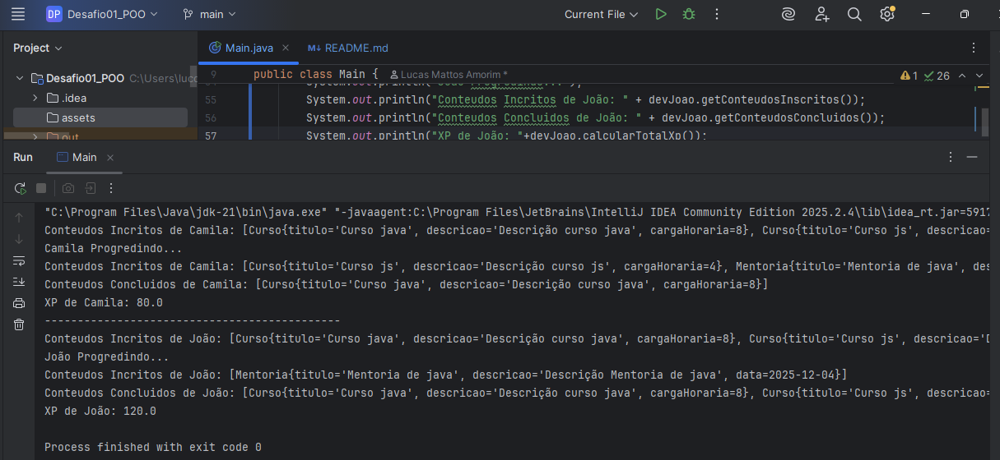

Desafio Projeto Orientação de Objetos com Java

Este projeto buscou explicar e aplicar os conceitos de orientação utilizando a linguagem Java

Conceitos abordados:

- Abstração
- Encapsulamento
- Herança
- Polimorfismo

</img>

Print do resultado final do exercicio